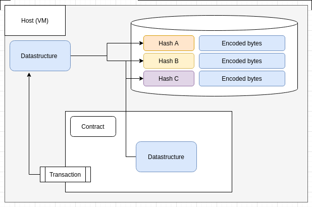

# canonical 0.6

Canonical is a serialization library specialized for merkle-trees.

## Serialization and FFI

When developing smart contracts in webassembly, communication between the host environment goes over foreign function interfaces, FFIs for short.

In the case of smart contracts, if we were to use for example the built-in hashmap of the rust language, the whole map would have to be serialized every time it was used in a transaction. This is clearly not practical when the map could contain thousands of entries.

When using merkle trees, it suffices to include only the root of the collection in a contract call, and when the wasm code is doing a lookup, it requests only the branches it needs.

## The `Id` and `Repr` types

A canonical `Repr` type, is a representation of a value, that can either be owned by the Repr itself, or stored as an `Id`. An `Id` is a representation of the encoded length of the value, and a payload.

```rust
pub struct Id {
    version: u8,
    len: u16,
    payload: Payload,
}
```

Given a hash length of 32 bytes, the Payload is also 32 bytes long. If the length of the data represented by the Id is larger than 32 bytes.

## Host and wasm differences

So, with the Repr and the Id we can create datastructures that get resolved or `reified` into their concrete type instances.

In the case of a wasm contract executing, a call to reify will be a host call, asking the host to fill in the correct bytes and parse them into a value.

On the host side, a lookup is performed in the current runtime memory storage of the host.

This distinction is invisible to the developer of contracts, and allows us to use the same datastructures and queries both on the host side to save performance, and on the wasm side for trustless contract execution.

Conceptually, we can refer to, and manipulate the same datastructures on "both sides" of the FFI boundrary



Paired with microkelvin, this becomes a very powerful tool for contract communication. A contract can for example easily call another and provide as argument a set with thousands of entries.


